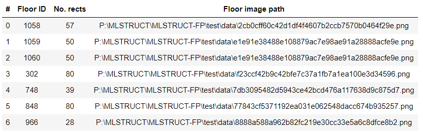
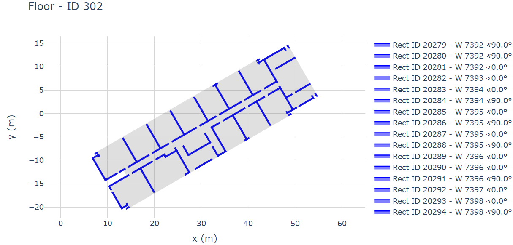
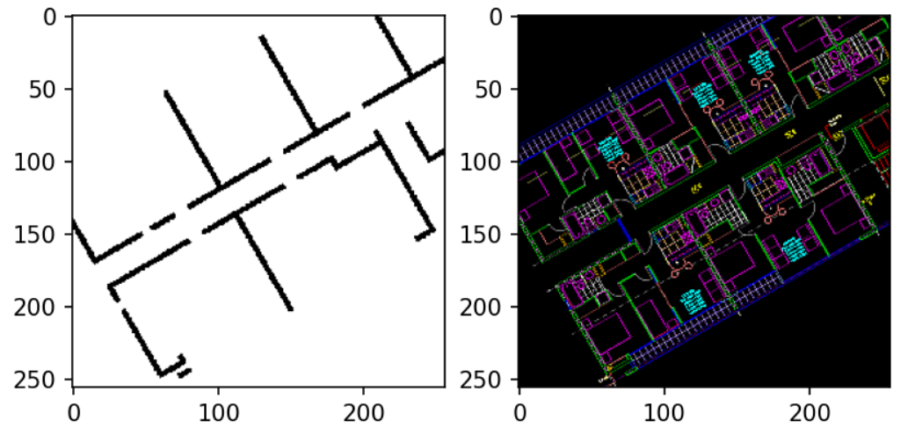

===========
MLSTRUCT-FP
===========

.. image:: https://img.shields.io/github/actions/workflow/status/MLSTRUCT/MLSTRUCT-FP/ci.yml?branch=master
    :target: https://github.com/MLSTRUCT/MLSTRUCT-FP/actions/workflows/ci.yml
    :alt: Build status

.. image:: https://img.shields.io/github/issues/MLSTRUCT/MLSTRUCT-FP
    :target: https://github.com/MLSTRUCT/MLSTRUCT-FP/issues
    :alt: Open issues

.. image:: https://badge.fury.io/py/MLStructFP.svg
    :target: https://pypi.org/project/MLStructFP
    :alt: PyPi package

.. image:: https://codecov.io/gh/MLSTRUCT/MLSTRUCT-FP/branch/master/graph/badge.svg?token=EJ8S2AAGUO
    :target: https://codecov.io/gh/MLSTRUCT/MLSTRUCT-FP
    :alt: Codecov

.. image:: https://img.shields.io/badge/license-MIT-blue.svg
    :target: https://opensource.org/licenses/MIT
    :alt: License MIT

**M**\ achine **L**\ earning **STRUCT**\ ural **F**\ loor **P**\ lan: A multi-unit floor plan dataset.

Description
-----------

This repo contains the base library to load and parse floor plans from the MLSTRUCT-FP dataset, which
contains over 954 large-scale floor plan images, alongside annotations for their walls in JSON
format. The database loader loads in memory the Floor, Walls, and Slab objects, and also
offers methods to create custom images from floor plans by applying a crop, a rotation, and a custom
scaling.

The images can be generated from the real rasterized plan or by using the polygons stored in the
JSON file. Both image and wall polygons are consistent in their placement.

See more information in our `published article <https://doi.org/10.1016/j.autcon.2023.105132>`_; also,
check out the `AI segmentation model <https://github.com/MLSTRUCT/MLSTRUCT-FP_benchmarks>`_ that tests this dataset.

First steps
-----------

To install the library, use the following python-pip commands:

.. code-block:: bash

    python -m pip install MLStructFP

To download the dataset (compressed in .zip), request a public download link by completing a
`simple form <https://forms.gle/HigdGxngnTEvnNC37>`_.

Dataset details
---------------

The dataset (uncompressed) has the following structure:

.. code-block:: bash

    dataset/
        0a0...736.png
        0a7...b41.png
        ...
        ff4...ff4.png
        ffd...faf.png
        fp.json

Each image is stored in PNG format with a transparent background. Image
size ranges between 6500 and 9500 px. Each file represents a distinct floor,
whose labels (wall polygons, slabs) and metadata are stored within fp.json.

The format of the fp.json file is characterized as follows:

.. code-block:: JSON

    {
        "rect": {
            "1000393": {
                "angle": 0.0,
                "floorID": 8970646,
                "length": 2.6,
                "line": [
                    0.0,
                    -15.039,
                    0.0
                ],
                "thickness": 0.2,
                "wallID": 5969311,
                "x": [
                    13.39,
                    15.99,
                    15.99,
                    13.39
                ],
                "y": [
                    -14.939,
                    -14.939,
                    -15.139,
                    -15.139
                ]
            },
            ...
        },
        "slab": {
            "1002588": {
                "floorID": 5980221,
                "x": [
                    -1.153,
                    4.897,
                    4.897,
                    ...
                ],
                "y": [
                    -22.622,
                    -22.622,
                    -19.117,
                    ...
                ],
            },
            ...
        },
        "floor": {
            "1014539": {
                "image": "83d4b2b46052b81347c2c369076ce9e792da8b7c.png",
                "scale": 193.412
            },
            ...
        }
    }

Note the dataset comprises a list of "rect" representing the rectangles (wall segments),
"slab," and "floor." Each item has a distinct ID for querying and grouping elements. In the example,
the rect ID ``1000393`` is within floor ID ``8970646``, with an angle of ``0`` degrees, a length
of ``2.6 m``, and within the wall ID ``5969311``. Likewise, the slab ``1002588`` is within floor
ID ``5980221``, whose its first point (x, y) is ``(-1.153, -22.622) m``. Finally, the floor ID
``1014539`` is associated with the image ``83d...8b7c.png`` and a scale ``193.412 px/m``. In total,
there are ``70873`` rects, ``954`` slabs and ``954`` floors.

Object API
----------

The primary usage of the API is illustrated on the
`jupyter notebook <https://github.com/MLSTRUCT/MLSTRUCT-FP/blob/master/example.ipynb>`_. The most fundamental
object is `DbLoader <https://github.com/MLSTRUCT/MLSTRUCT-FP/blob/master/MLStructFP/db/_db_loader.py>`_,
which receives the path of the ``fp.json`` file.

.. code-block:: python

    class DbLoader(db: str)

    # Example
    db = DbLoader('test/data/fp.json')
    db.tabulate()

DbLoader creates a dict of `Floor <https://github.com/MLSTRUCT/MLSTRUCT-FP/blob/master/MLStructFP/db/_floor.py>`_ object,
which each contains a dict of `Rect <https://github.com/MLSTRUCT/MLSTRUCT-FP/blob/master/MLStructFP/db/_c_rect.py>`_ and
`Slab <https://github.com/MLSTRUCT/MLSTRUCT-FP/blob/master/MLStructFP/db/_c_slab.py>`_ objects. Each item is associated
with their respective IDs. Floor objects also have many methods to retrieve their elements, plot, and apply
transformations (aka mutations) such as scaling or rotation using the ``mutate()`` method:

.. code-block:: python

    class Floor:
        ...

        def mutate(self, angle: NumberType = 0, sx: NumberType = 1, sy: NumberType = 1,
                scale_first: bool = True) -> 'Floor':
            ...

    # Example
    plot_floor = db.floor[302]
    plot_floor.mutate(30, 1, 1)  # 30 degrees, scale one on the x-axis, one on the y-axis
    plot_floor.plot_complex()

Finally, the most important classes are
`RectBinaryImage <https://github.com/MLSTRUCT/MLSTRUCT-FP/blob/master/MLStructFP/db/image/_rect_binary.py>`_ and
`RectFloorPhoto <https://github.com/MLSTRUCT/MLSTRUCT-FP/blob/master/MLStructFP/db/image/_rect_photo.py>`_, whose
main responsibilities are creating plan crops for machine learning model training. These classes perform crops
and downsampling on any image size and scale factor. For both objects, the main methods are:

.. code-block:: python

    def make_rect(self, rect: 'Rect', crop_length: NumberType = 5) -> Tuple[int, 'np.ndarray']:

    def make_region(self, xmin: NumberType, xmax: NumberType, ymin: NumberType, ymax: NumberType,
                    floor: 'Floor', rect: Optional['Rect'] = None) -> Tuple[int, 'np.ndarray']:

The first creates a crop around the provided rect (using its position as the center, adding ``crop_length`` m
for each axis). The second one creates a region on any arbitrary ``(xmin, ymin, xmax, ymax)`` region. Consider
each position in meters.

From the provided notebook example, the following image shows two crops generated using a mutated floor plan
with 30 30-degree angle rotation. Crops are 256x256 px`` in size and display a ``10x10 m`` region for a selected
rectangle as the origin.

Citing
------

.. code-block:: tex
    
    @article{Pizarro2023,
      title = {Large-scale multi-unit floor plan dataset for architectural plan analysis and
               recognition},
      journal = {Automation in Construction},
      volume = {156},
      pages = {105132},
      year = {2023},
      issn = {0926-5805},
      doi = {https://doi.org/10.1016/j.autcon.2023.105132},
      url = {https://www.sciencedirect.com/science/article/pii/S0926580523003928},
      author = {Pablo N. Pizarro and Nancy Hitschfeld and Ivan Sipiran}
    }

Author
------

`Pablo Pizarro R. <https://ppizarror.com>`_ | 2023 - 2025
